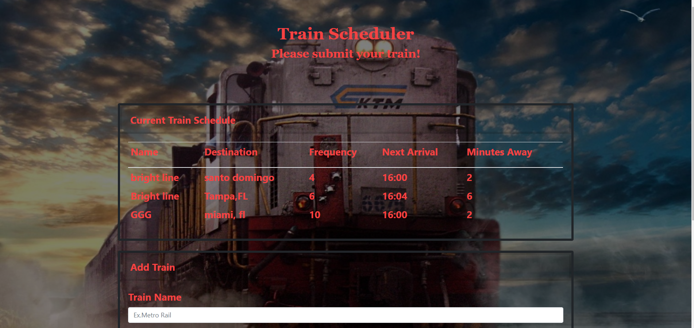

# Firebase / Train Scheduler

Please click the link to see the working app.

URL: https://omarvegaabreu.github.io/trainScheduler/

This is a train schedule application that incorporates Firebase to host arrival and departure data for trains. The app will retrieve and manipulate this information with Moment.js. This App will provide up-to-date information about various trains, namely their arrival times and how many minutes remain until they arrive at their station.

### Instructions

- When adding trains, administrators will be able to submit the following:

  - Train Name

  - Destination

  - First Train Time -- in military time

  - Frequency -- in minutes

- This app will calculate when the next train will arrive; this will be relative to the current time.

- Users from many different machines will be able to view same train times.

### Technologies used
-Bootstrap
-HTML/CSS
-JavaScript 
-jQuery
-Firebase
